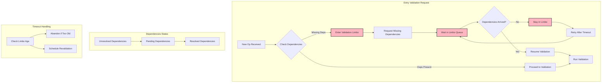
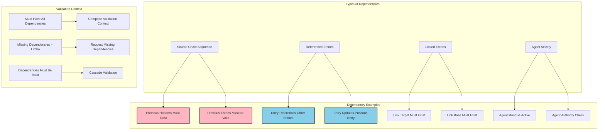
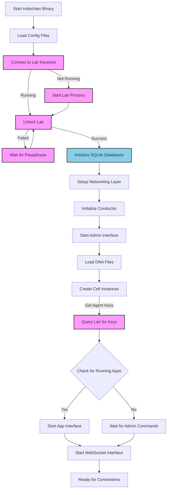
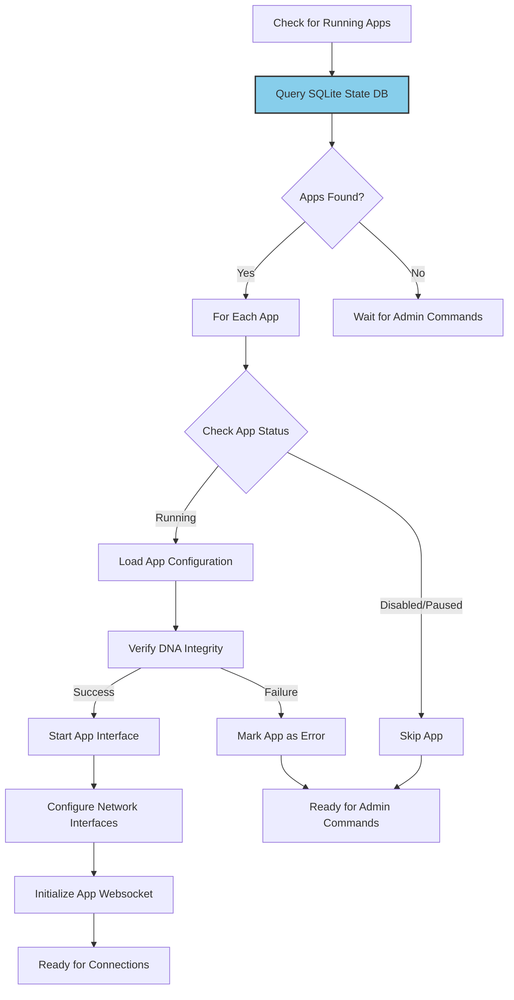
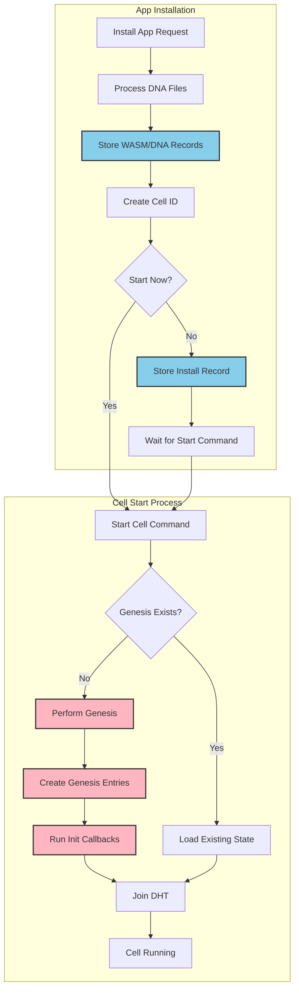
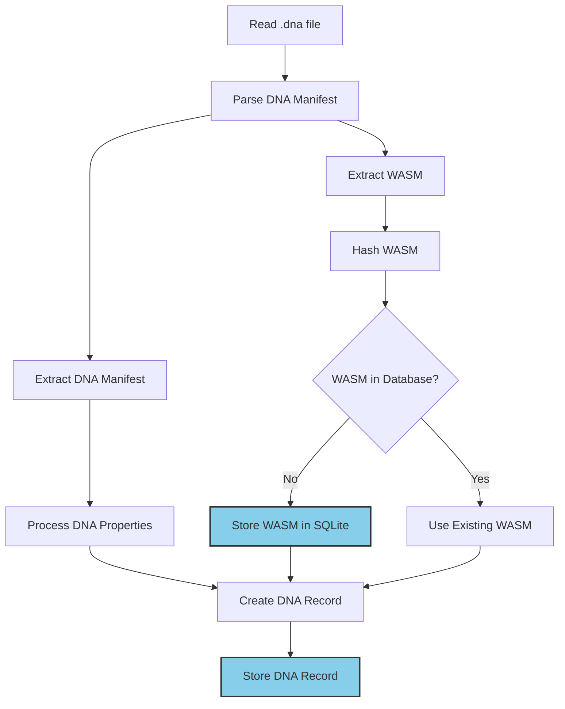
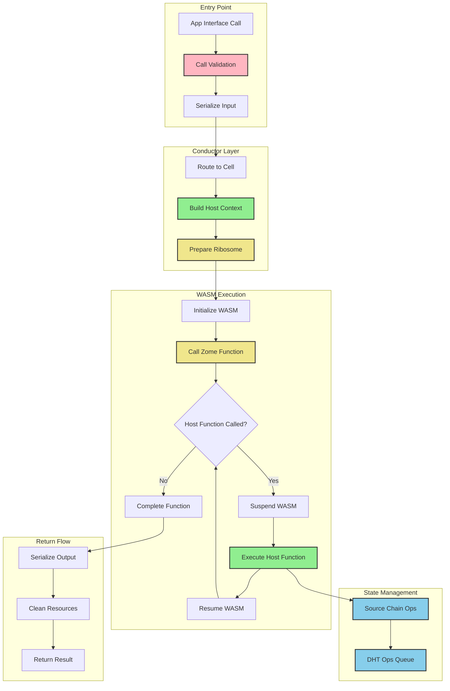
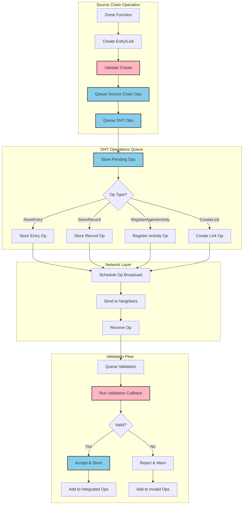

# Holochain Workflows

> [!IMPORTANT]  
> Code snippets used in this document do not fully reflect the actual implementation in holochain.

### Table of Contents

- [Holochain Workflows](#holochain-workflows)
- [Cell Workflows](#cell-workflows)
  - [Initialization Flow](#1-initialization-flow)
  - [WASM Call Flow](#2-wasm-call-flow)
  - [DHT Operations Flow](#3-dht-operations-flow)
  - [Network Flow](#4-network-flow-handles-all-network-communication)
  - [Query Flow](#5-query-flow-how-data-is-retrieved)
  - [Key things to note](#6-key-things-to-note)
- [Validation limbo](#validation-limbo)
  - [Why Entries Enter Limbo](#why-entries-enter-limbo)
  - [The Limbo Process](#the-limbo-process)
  - [Real World Example](#real-world-example)
  - [Common Scenarios](#common-scenarios)
- [Dependencies in validation](#dependencies-in-validation)
  - [Chain Dependencies](#chain-dependencies)
  - [Reference Dependencies](#reference-dependencies)
  - [Agent Dependencies](#agent-dependencies)
  - [Custom Validation Dependencies](#custom-validation-dependencies)
- [Startup](#startup)
  - [Key Components](#key-components)
- [Check for Running hApps](#check-for-running-happs)
  - [Key Components](#key-components-1)
- [hApp Installation and Genesis](#happ-installation-and-genesis)
  - [Key Components](#key-components-2)
- [DNA Installation](#dna-installation)
  - [Key Components](#key-components-3)
- [Zome Call](#zome-call)
  - [Key Components](#key-components-4)
- [Validation Operations](#validation-operations)
  - [Key Components](#key-components-5)

## Cell Workflows

```mermaid
graph TD
    subgraph "Initialization Flow"
        A1[DNA Activation] --> A2[Genesis]
        A2 --> A3[Initialize Zomes]
        A3 --> A4[First Run Setup]
        A4 --> A5[Cell Ready State]
    end

    subgraph "WASM Call Flow"
        B1[Zome Function Call] --> B2[WASM Ribosome Setup]
        B2 --> B3[Host Function Bridge]
        B3 --> B4[Source Chain Ops]
        B4 --> B5[Generate DHT Ops]
        B5 --> B6[Return Results]
    end

    subgraph "DHT Operations Flow"
        C1[Publish Entry/Link] --> C2[Queue DHT Op]
        C2 --> C3[System Validation]
        C3 --> C4[WASM Validation]
        C4 --> C5[App Validation]
        C5 --> C6[Integration Process]
        C6 --> C7[Store Valid Op]
        C7 --> C8[Send Validation Receipt]
    end

    subgraph "Network Flow"
        D1[Remote Call Request] --> D2[Handle Remote Zome Call]
        D2 --> D3[Process Direct Message]

        D4[Gossip Request] --> D5[Handle Get Request]
        D5 --> D6[Handle Get Links]
        D6 --> D7[Handle Validation Receipt]

        D8[Publish Request] --> D9[Handle Publish]
        D9 --> D10[Disseminate Warrant]
    end

    subgraph "Query Flow"
        E1[Get Query] --> E2[Check Local Cache]
        E2 --> E3[Check Local Source Chain]
        E3 --> E4[Check DHT Cache]
        E4 --> E5[Query Network Peers]
        E5 --> E6[Build Response]
    end

    style B2 fill:#FF6B6B,stroke:#333,stroke-width:2px
    style B3 fill:#FF6B6B,stroke:#333,stroke-width:2px
    style C4 fill:#FF6B6B,stroke:#333,stroke-width:2px
    style E2 fill:#4ECDC4,stroke:#333,stroke-width:2px
    style E3 fill:#4ECDC4,stroke:#333,stroke-width:2px
    style E4 fill:#4ECDC4,stroke:#333,stroke-width:2px

```



#### 1. Initialization Flow

- Genesis happens when a cell is first activated
- This creates the initial source chain with DNA and Agent key entries
- Zomes are initialized in sequence
- Any init callbacks defined in the zomes are run
- Cell enters "ready" state for regular operation

```rust
// Genesis and initialization
struct InitializationFlow {
    // DNA activation starts the process
    dna_file: DnaFile,
    // Genesis creates initial state
    genesis: GenesisResult,
    // Zome initialization
    zome_init: Vec<ZomeInit>,
    // First run setup
    first_run: FirstRunResult,
}
```

#### 2. WASM Call Flow

- App/client makes a zome function call
- Conductor sets up the WASM environment (Ribosome)
- WASM code executes, potentially making host function calls which:
  - Suspend WASM execution
  - Perform the host operation (like reading/writing data)
  - Resume WASM with the result
- Any source chain operations are queued
- DHT operations are generated from source chain ops
- Results are returned to the caller

```rust
// WASM call processing
struct WasmCallFlow {
    // Incoming zome call
    call: ZomeCall,
    // Set up WASM environment
    ribosome: Ribosome,
    // Process host functions
    host_access: HostAccess,
    // Handle source chain ops
    source_chain: SourceChainResult,
    // Generate DHT ops
    dht_ops: Vec<DhtOp>,
}
```

#### 3. DHT Operations Flow

- When new data needs to be published to the DHT:
  - System validation checks integrity, signatures, etc.
  - WASM validation runs custom validation callbacks
  - App validation ensures consistency with app rules
- Valid operations are integrated into the DHT
- Validation receipts are sent back to the author
- Data becomes available for network queries
- Invalid operations are rejected with reasons

```rust
// DHT operation processing
struct DhtOpFlow {
    // Initial op creation
    op: DhtOp,
    // Validation stages
    system_validation: ValidationResult,
    wasm_validation: ValidationResult,
    app_validation: ValidationResult,
    // Integration
    integration: IntegrationResult,
    // Receipt handling
    receipt: ValidationReceipt,
}
```

#### 4. Network Flow (handles all network communication)

- Remote Zome Calls:

  - Receive call from remote agent
  - Process through local WASM
  - Return results

> [!NOTE]
> Remote zome calls allow one agent to execute functions on another agent's cell, subject to capability grants, enabling secure peer-to-peer interactions in Holochain applications.

- Gossip Protocol:

  - Regular exchange of metadata
  - Request missing data
  - Share validation receipts

> [!NOTE]
> Gossip requests are automatic peer-to-peer exchanges where agents compare notes about what data they have or are missing, helping the DHT network self-heal and maintain data availability over time.

- DHT Operations:

  - Publish new entries/links
  - Handle incoming validation requests
  - Disseminate warrants

> [!NOTE]
> A publish request is how agents share new entries or links to the DHT, requiring validation from multiple peers through system, app, and WASM validation checks before integration into the network.

```rust
// Network message handling
struct NetworkFlow {
    // Remote call handling
    remote_call: RemoteCallResult,
    // Gossip protocol
    gossip: GossipData,
    // Publication handling
    publish: PublishResult,
    // Warrant dissemination
    warrant: WarrantResult,
}
```

#### 5. Query Flow (how data is retrieved)

- Check local cache first (fastest)
- Look in local source chain
- Check DHT cache
- If not found locally:
- Query network peers
  - Wait for responses
  - Aggregate results
  - Update local cache
- Return results to caller

```rust
// Data query cascade
struct QueryFlow {
    // Query levels
    local_cache: Option<Entry>,
    source_chain: Option<Entry>,
    dht_cache: Option<Entry>,
    network_query: NetworkQueryResult,
    // Final response
    response: QueryResponse,
}
```

### Key things to note

- These workflows interact constantly
- Each has its own validation requirements
- Caching happens at multiple levels
- Network operations are asynchronous
- Everything is validated before integration

### Validation Limbo

Validation limbo happens when an operation (op) is waiting for its dependencies to be validated before it can be validated itself. This is a crucial part of Holochain's dependency-aware validation system.



Here's what's happening:

#### 1. Why Entries Enter Limbo:

- Missing previous source chain entries
- Missing linked entries
- Missing entries referenced in the validation callback
- Missing agent activity for validation context

#### 2. The Limbo Process:

```
Receive Op -> Check Dependencies -> If Missing:
   |-> Put in Limbo Queue
   |-> Request Missing Dependencies
   |-> Wait for Dependencies
   |-> Periodically Retry
   |-> Either Timeout or Proceed when Dependencies Arrive
```

#### 3. Real World Example:

```rust
// An entry that references another entry
{
    previous_entry: EntryHash,  // Must exist
    content: "My new data"
}

// If previous_entry isn't validated yet:
// 1. This entry goes to limbo
// 2. System requests previous_entry
// 3. Waits for previous_entry to be validated
// 4. Then validates this entry
```

#### 4. Common Scenarios:

- Chain gaps (missing entries in sequence)
- Cross-references between entries
- Links to unvalidated entries
- Dependencies on agent activity
- Complex validation rules requiring other data

### what are dependencies in the context of validation



Dependencies in validation are:

#### 1. Chain Dependencies:

- Each entry must reference valid previous entries
- Headers must form an unbroken chain
- Sequence numbers must be continuous

```rust
// Example chain dependency
struct Header {
    previous_header: HeaderHash,  // Must exist and be valid
    sequence_number: u32,        // Must be previous + 1
    // ...
}
```

2. Reference Dependencies:

- When one entry refers to another entry
- Updates to existing entries
- Links between entries

```rust
// Example entry with dependencies
struct MyEntry {
    references: Vec<EntryHash>,  // All must exist
    updates: Option<EntryHash>,  // Must exist if present
    // ...
}
```

#### 3. Agent Dependencies:

- Valid agent public key
- Agent must be active in DHT
- Authority to perform actions
- Previous agent activity required for context

#### 4. Custom Validation Dependencies:

```rust
#[hdk_extern]
fn validate(op: Op) -> ExternResult<ValidateCallbackResult> {
    // Example: Entry depends on other entry existing
    let other_entry = must_get_valid_record(op.references.other_hash)?;

    if other_entry.is_none() {
        return Ok(ValidateCallbackResult::UnresolvedDependencies(
            vec![op.references.other_hash]
        ));
    }
    // ... rest of validation
}
```

## Startup



### Key Components

- **Lair Keystore Integration** (highlighted in pink):

  - Lair is Holochain's secure key management system
  - Handles agent key creation and storage
  - Requires passphrase authentication for access
  - Must be running before Holochain can access keys

- **Data Storage** (highlighted in blue):
  - SQLite databases store local state and DHT data
  - Initializes storage for source chains and DHT operations
  - Maintains persistent state across restarts

## Check for Running hApps



### Key Components

- **State Management** (highlighted in blue):

  - SQLite queries determine which apps were previously running
  - Maintains app configurations and state between sessions

- **Recovery Process**:
  - Automatically restarts previously running applications
  - Verifies DNA integrity before startup
  - Establishes necessary network interfaces

## hApp Installation and Genesis



### Key Components

- **Storage Operations** (highlighted in blue):

  - Stores DNA and WASM modules
  - Maintains installation records
  - Tracks cell status and configuration

- **Genesis Process** (highlighted in pink):
  - One-time initialization of new cells
  - Creates initial entries in the source chain
  - Runs initialization callbacks
  - Critical for establishing cell state

## DNA Installation



### Key Components

- **Storage Operations** (highlighted in blue):

  - Deduplicates WASM modules
  - Stores DNA records with properties
  - Maintains integrity through hashing

- **Key Elements**:
  - DNA manifest defines application properties
  - WASM modules contain application logic
  - Properties configure DNA behavior

## Zome Call



### Key Components

- **Validation Layer** (highlighted in pink):

  - Ensures calls are properly formatted
  - Validates permissions and capabilities

- **Host Functions** (highlighted in green):

  - Provides interface between WASM and host
  - Manages core Holochain capabilities

- **WASM Execution** (highlighted in yellow):

  - Runs application logic in sandbox
  - Manages state transitions
  - Handles host function calls

- **State Management** (highlighted in blue):
  - Records operations to source chain
  - Queues DHT operations
  - Ensures data consistency

## Validation Operations

> [!NOTE]
> Operations (Ops) in Holochain are atomic units of change that need to be processed and validated by the DHT network, representing actions like storing entries, creating links, or registering agent activity.



### Key Components

- **Validation Checks** (highlighted in pink):

  - Runs validation callbacks
  - Ensures data integrity
  - Maintains network consensus

- **Storage Operations** (highlighted in blue):
  - Queues operations for processing
  - Stores validated data
  - Tracks invalid operations
  - Maintains operation status
