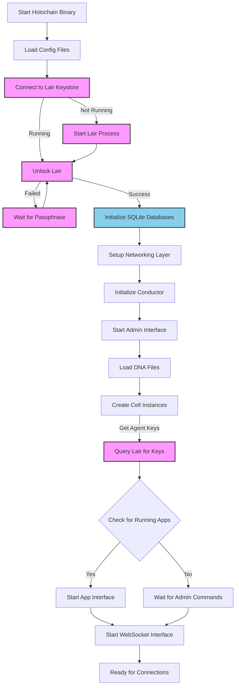
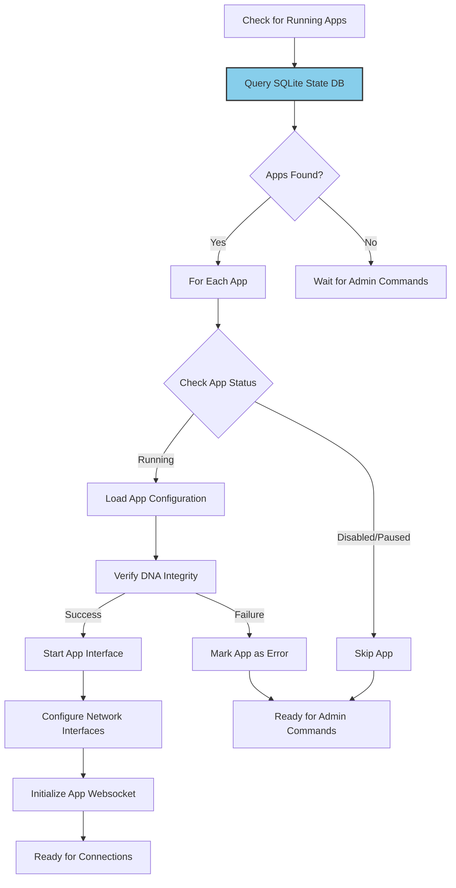
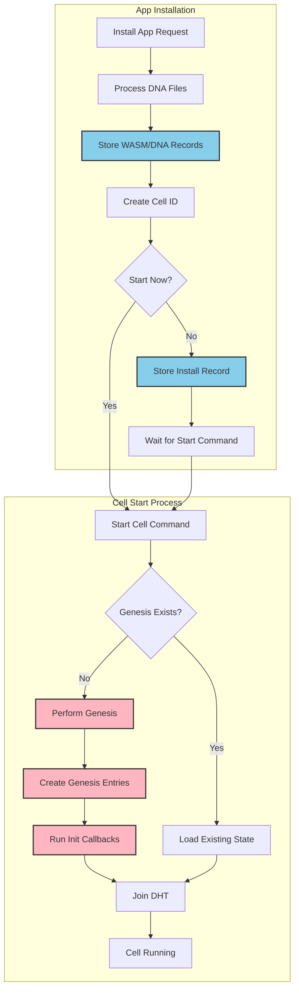
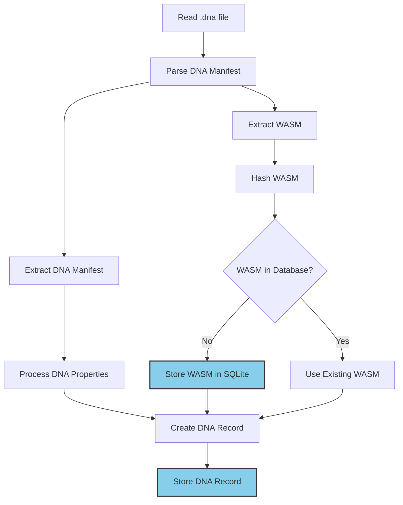
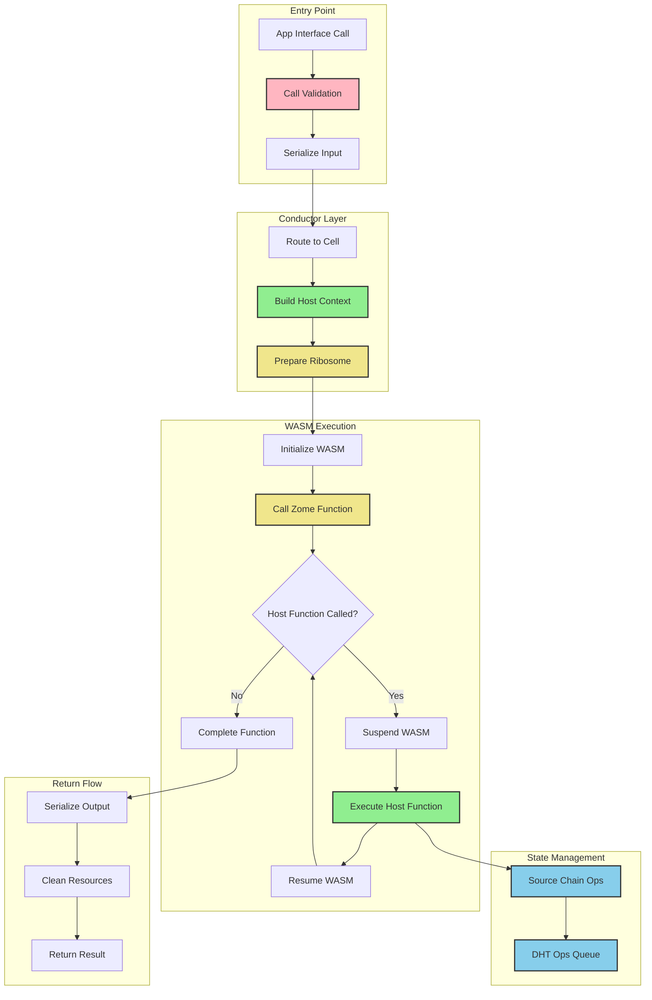
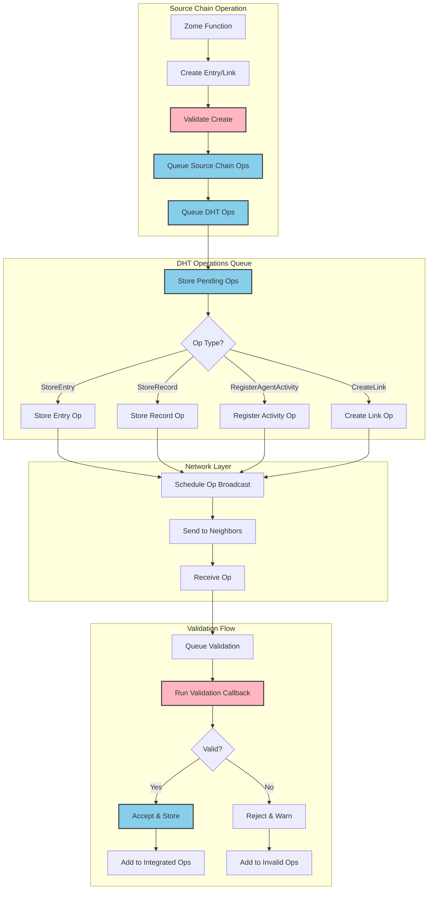

# Holochain Workflows

## Startup

### Key Components

- **Lair Keystore Integration** (highlighted in pink):

  - Lair is Holochain's secure key management system
  - Handles agent key creation and storage
  - Requires passphrase authentication for access
  - Must be running before Holochain can access keys

- **Data Storage** (highlighted in blue):
  - SQLite databases store local state and DHT data
  - Initializes storage for source chains and DHT operations
  - Maintains persistent state across restarts

## Check for Running hApps

### Key Components

- **State Management** (highlighted in blue):

  - SQLite queries determine which apps were previously running
  - Maintains app configurations and state between sessions

- **Recovery Process**:
  - Automatically restarts previously running applications
  - Verifies DNA integrity before startup
  - Establishes necessary network interfaces

## hApp Installation and Genesis

### Key Components

- **Storage Operations** (highlighted in blue):

  - Stores DNA and WASM modules
  - Maintains installation records
  - Tracks cell status and configuration

- **Genesis Process** (highlighted in pink):
  - One-time initialization of new cells
  - Creates initial entries in the source chain
  - Runs initialization callbacks
  - Critical for establishing cell state

## DNA Installation

### Key Components

- **Storage Operations** (highlighted in blue):

  - Deduplicates WASM modules
  - Stores DNA records with properties
  - Maintains integrity through hashing

- **Key Elements**:
  - DNA manifest defines application properties
  - WASM modules contain application logic
  - Properties configure DNA behavior

## Zome Call

### Key Components

- **Validation Layer** (highlighted in pink):

  - Ensures calls are properly formatted
  - Validates permissions and capabilities

- **Host Functions** (highlighted in green):

  - Provides interface between WASM and host
  - Manages core Holochain capabilities

- **WASM Execution** (highlighted in yellow):

  - Runs application logic in sandbox
  - Manages state transitions
  - Handles host function calls

- **State Management** (highlighted in blue):
  - Records operations to source chain
  - Queues DHT operations
  - Ensures data consistency

## Validation Operations

### Key Components

- **Validation Checks** (highlighted in pink):

  - Runs validation callbacks
  - Ensures data integrity
  - Maintains network consensus

- **Storage Operations** (highlighted in blue):
  - Queues operations for processing
  - Stores validated data
  - Tracks invalid operations
  - Maintains operation status

## Best Practices

1. **Error Handling**:

   - Monitor validation results
   - Handle rejected operations gracefully
   - Implement retry mechanisms for network operations

2. **Performance**:

   - Batch DHT operations when possible
   - Implement efficient validation callbacks
   - Monitor queue sizes and processing times

3. **Security**:

   - Secure Lair keystore access
   - Implement thorough validation rules
   - Monitor for invalid operations

4. **Maintenance**:
   - Regular monitoring of SQLite databases
   - Clean up invalid operations
   - Monitor network connectivity
