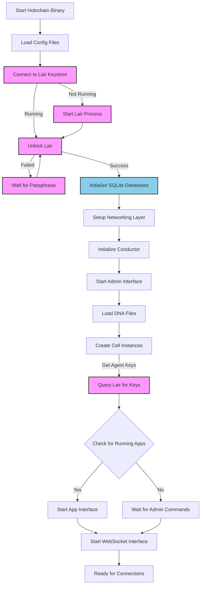
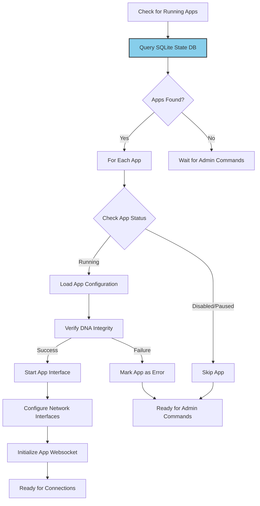
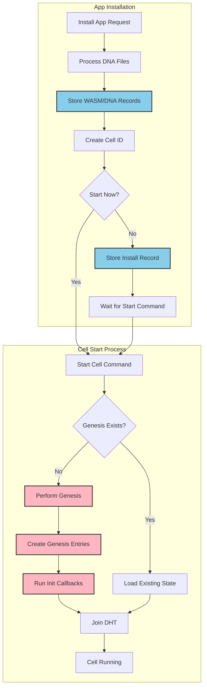
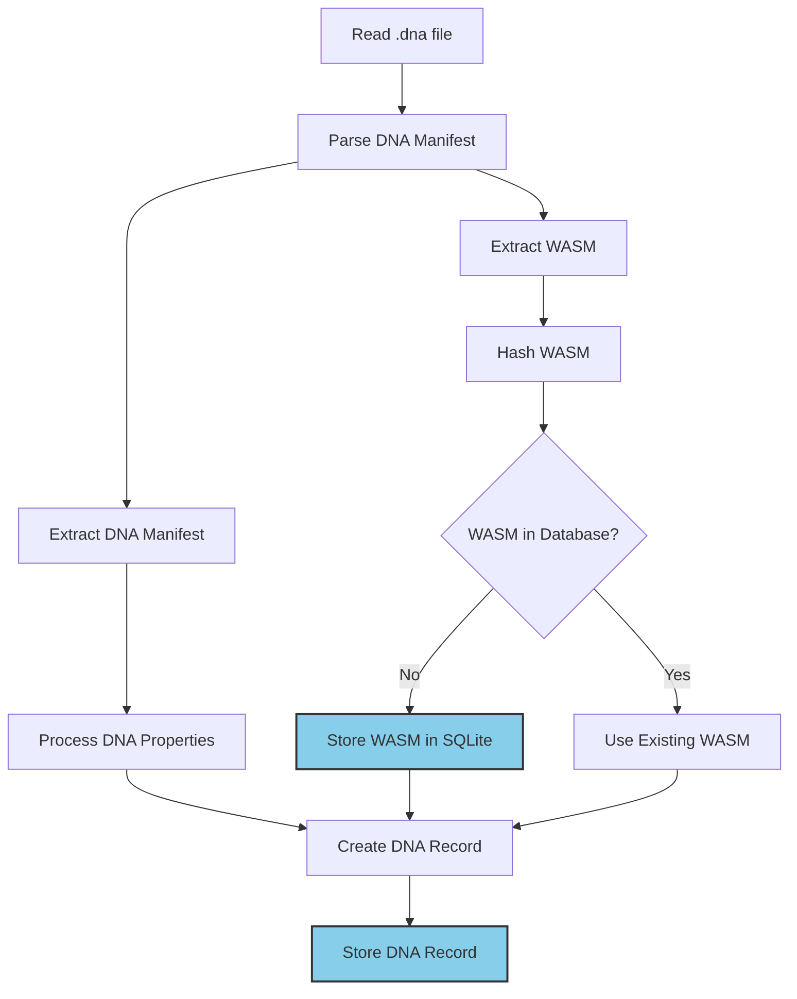
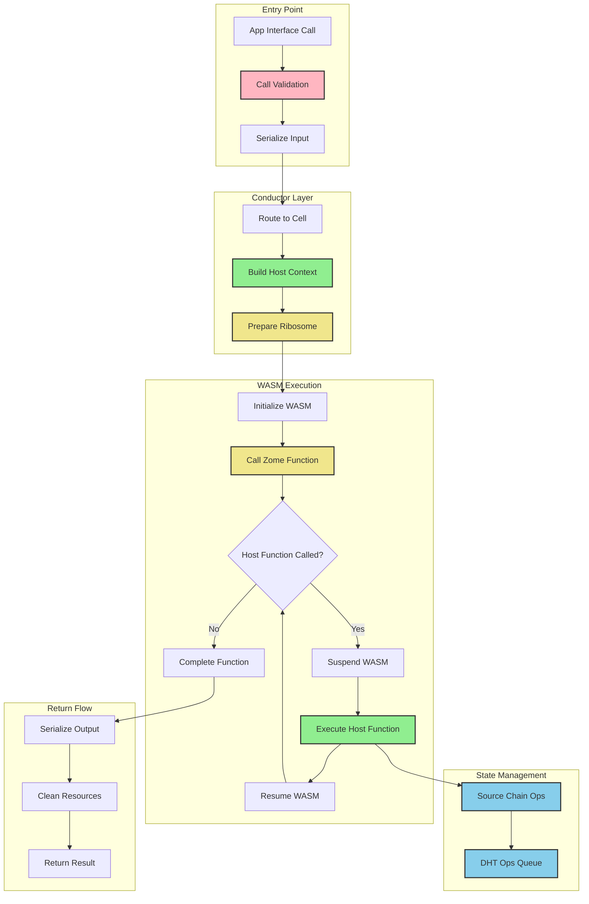
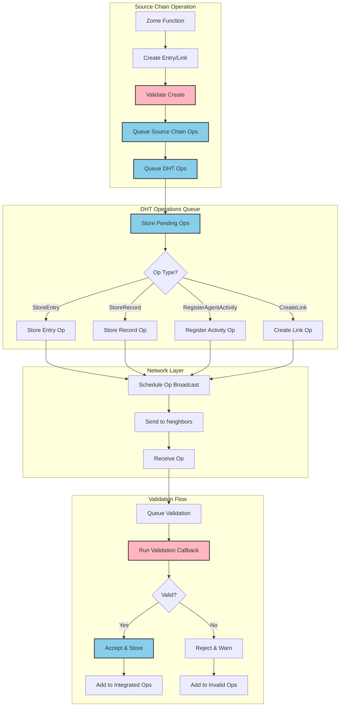

# holochain workflows

## startup

```mermaid
flowchart TB
    A[Start Holochain Binary] --> B[Load Config Files]
    B --> C[Connect to Lair Keystore]

    C -->|Not Running| D[Start Lair Process]
    C -->|Running| E[Unlock Lair]

    D --> E
    E -->|Failed| F[Wait for Passphrase]
    F --> E

    E -->|Success| G[Initialize SQLite Databases]
    G --> H[Setup Networking Layer]
    H --> I[Initialize Conductor]
    I --> J[Start Admin Interface]
    J --> K[Load DNA Files]
    K --> L[Create Cell Instances]
    L -->|Get Agent Keys| M[Query Lair for Keys]
    M --> N{Check for Running Apps}
    N -->|Yes| O[Start App Interface]
    N -->|No| P[Wait for Admin Commands]
    O --> Q[Start WebSocket Interface]
    P --> Q
    Q --> R[Ready for Connections]

    style C fill:#f9f,stroke:#333,stroke-width:2px
    style D fill:#f9f,stroke:#333,stroke-width:2px
    style E fill:#f9f,stroke:#333,stroke-width:2px
    style F fill:#f9f,stroke:#333,stroke-width:2px
    style M fill:#f9f,stroke:#333,stroke-width:2px
    style G fill:#87CEEB,stroke:#333,stroke-width:2px
```

## check for running hApp

```mermaid
flowchart TB
    A[Check for Running Apps] --> B[Query SQLite State DB]
    B --> C{Apps Found?}

    C -->|Yes| D[For Each App]
    C -->|No| E[Wait for Admin Commands]

    D --> F{Check App Status}
    F -->|Running| G[Load App Configuration]
    F -->|Disabled/Paused| H[Skip App]

    G --> I[Verify DNA Integrity]
    I -->|Success| J[Start App Interface]
    I -->|Failure| K[Mark App as Error]

    J --> L[Configure Network Interfaces]
    L --> M[Initialize App Websocket]

    H --> N[Ready for Admin Commands]
    K --> N
    M --> O[Ready for Connections]

    style B fill:#87CEEB,stroke:#333,stroke-width:2px
```

## hApp installation and genesis

```mermaid
flowchart TB
    subgraph "App Installation"
        A[Install App Request] --> B[Process DNA Files]
        B --> C[Store WASM/DNA Records]
        C --> D[Create Cell ID]
        D --> E{Start Now?}
        E -->|No| F[Store Install Record]
        F --> G[Wait for Start Command]
    end

    subgraph "Cell Start Process"
        H[Start Cell Command] --> I{Genesis Exists?}
        I -->|No| J[Perform Genesis]
        I -->|Yes| K[Load Existing State]

        J --> L[Create Genesis Entries]
        L --> M[Run Init Callbacks]
        M --> N[Join DHT]

        K --> N
        N --> O[Cell Running]
    end

    E -->|Yes| H
    G --> H

    style C fill:#87CEEB,stroke:#333,stroke-width:2px
    style F fill:#87CEEB,stroke:#333,stroke-width:2px
    style J fill:#FFB6C1,stroke:#333,stroke-width:2px
    style L fill:#FFB6C1,stroke:#333,stroke-width:2px
    style M fill:#FFB6C1,stroke:#333,stroke-width:2px
```

## dna installation

```mermaid
flowchart TB
    A[Read .dna file] --> B[Parse DNA Manifest]
    B --> C[Extract WASM]
    B --> D[Extract DNA Manifest]

    C --> E[Hash WASM]
    D --> F[Process DNA Properties]

    E --> G{WASM in Database?}
    G -->|No| H[Store WASM in SQLite]
    G -->|Yes| I[Use Existing WASM]

    F --> J[Create DNA Record]
    H --> J
    I --> J

    J --> K[Store DNA Record]

    style H fill:#87CEEB,stroke:#333,stroke-width:2px
    style K fill:#87CEEB,stroke:#333,stroke-width:2px
```

## zome call

```mermaid
flowchart TB
    subgraph "Entry Point"
        A[App Interface Call] --> B[Call Validation]
        B --> C[Serialize Input]
    end

    subgraph "Conductor Layer"
        C --> D[Route to Cell]
        D --> E[Build Host Context]
        E --> F[Prepare Ribosome]
    end

    subgraph "WASM Execution"
        F --> G[Initialize WASM]
        G --> H[Call Zome Function]

        H --> I{Host Function Called?}
        I -->|Yes| J[Suspend WASM]
        J --> K[Execute Host Function]
        K --> L[Resume WASM]
        L --> I

        I -->|No| M[Complete Function]
    end

    subgraph "State Management"
        K --> N[Source Chain Ops]
        N --> O[DHT Ops Queue]
    end

    subgraph "Return Flow"
        M --> P[Serialize Output]
        P --> Q[Clean Resources]
        Q --> R[Return Result]
    end

    style B fill:#FFB6C1,stroke:#333,stroke-width:2px
    style E fill:#90EE90,stroke:#333,stroke-width:2px
    style F fill:#F0E68C,stroke:#333,stroke-width:2px
    style H fill:#F0E68C,stroke:#333,stroke-width:2px
    style K fill:#90EE90,stroke:#333,stroke-width:2px
    style N fill:#87CEEB,stroke:#333,stroke-width:2px
    style O fill:#87CEEB,stroke:#333,stroke-width:2px

```

## validation ops

```mermaid
flowchart TB
    subgraph "Source Chain Operation"
        A[Zome Function] --> B[Create Entry/Link]
        B --> C[Validate Create]
        C --> D[Queue Source Chain Ops]
        D --> E[Queue DHT Ops]
    end

    subgraph "DHT Operations Queue"
        E --> F[Store Pending Ops]
        F --> G{Op Type?}
        G -->|StoreEntry| H[Store Entry Op]
        G -->|StoreRecord| I[Store Record Op]
        G -->|RegisterAgentActivity| J[Register Activity Op]
        G -->|CreateLink| K[Create Link Op]
    end

    subgraph "Network Layer"
        H & I & J & K --> L[Schedule Op Broadcast]
        L --> M[Send to Neighbors]
        M --> N[Receive Op]
    end

    subgraph "Validation Flow"
        N --> O[Queue Validation]
        O --> P[Run Validation Callback]
        P --> Q{Valid?}
        Q -->|Yes| R[Accept & Store]
        Q -->|No| S[Reject & Warn]

        R --> T[Add to Integrated Ops]
        S --> U[Add to Invalid Ops]
    end

    style C fill:#FFB6C1,stroke:#333,stroke-width:2px
    style P fill:#FFB6C1,stroke:#333,stroke-width:2px
    style D fill:#87CEEB,stroke:#333,stroke-width:2px
    style E fill:#87CEEB,stroke:#333,stroke-width:2px
    style F fill:#87CEEB,stroke:#333,stroke-width:2px
    style R fill:#87CEEB,stroke:#333,stroke-width:2px
```
