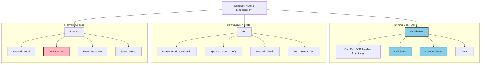
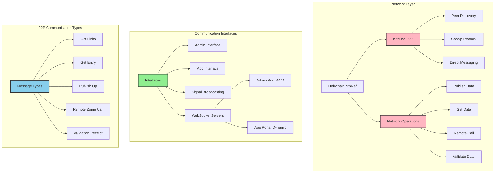
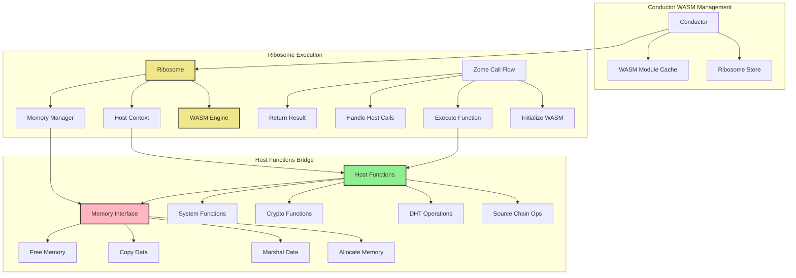
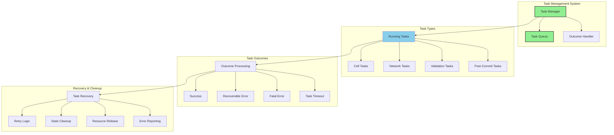

# the conductor

The Holochain Conductor is the core runtime service that manages the entire Holochain node ecosystem, responsible for running cells (DNA + AgentKey pairs), handling network communication, managing WASM execution, coordinating app interfaces, and maintaining system state.

Main responsibilities:

1. Cell Management:

- Creates and manages cells (DNA + Agent Key combinations)
- Handles cell lifecycle (start, stop, pause)
- Manages source chains and cell state
- Coordinates cell interactions

2. Interface Provision:

- Runs the admin interface (typically port 4444)
- Manages multiple app interfaces (websocket servers)
- Handles signal broadcasting
- Routes incoming requests to appropriate cells

3. WASM Execution:

- Maintains the Ribosome (WASM runtime)
- Manages WASM module cache
- Handles host functions
- Coordinates zome calls

4. Network Coordination:

- Manages P2P connections through Kitsune
- Handles DHT operations
- Coordinates peer discovery
- Manages network spaces

5. State Management:

- Maintains system configuration
- Manages persistent storage (SQLite)
- Handles key management (via Lair)
- Coordinates state updates

6. Resource Management:

- Task scheduling and management
- Memory management
- Cache coordination
- System resources allocation

The conductor essentially acts as the "operating system" for Holochain applications, providing all the necessary services and coordination for hApps to function in a distributed environment.

## Key Components

```mermaid
flowchart TB
    A[Conductor]

    subgraph "Core State"
        B1[Running Cells]
        B2[Config]
        B3[Spaces]
    end

    subgraph "Services & Interfaces"
        C1[Admin Websocket Ports]
        C2[Task Manager]
        C3[Keystore Client]
        C4[P2P Network]
        C5[Running Services]
    end

    subgraph "WASM & Execution"
        D1[Ribosome Store]
        D2[Wasmer Module Cache]
        D3[Post Commit Handler]
    end

    subgraph "App Management"
        E1[App Auth Tokens]
        E2[App Broadcast]
    end

    A --> B1
    A --> B2
    A --> B3

    A --> C1
    A --> C2
    A --> C3
    A --> C4
    A --> C5

    A --> D1
    A --> D2
    A --> D3

    A --> E1
    A --> E2

    style B1 fill:#87CEEB,stroke:#333,stroke-width:2px
    style C4 fill:#FFB6C1,stroke:#333,stroke-width:2px
    style D1 fill:#F0E68C,stroke:#333,stroke-width:2px
    style D2 fill:#F0E68C,stroke:#333,stroke-width:2px
```



### State Management



Components:

1. Running Cells (`running_cells`):

```rust
/// Manages active cells in the conductor
pub struct CellItem {
    // The cell instance
    cell: Arc<Cell>,
    // Cell's current status
    status: CellStatus,
    // Handles to running cell tasks
    tasks: Vec<JoinHandle<()>>,
}

/// Concurrent access to cell map
type RunningCells = RwShare<HashMap<CellId, CellItem>>;
```

2. Configuration (`config`):

```rust
/// Conductor configuration
pub struct ConductorConfig {
    // Database and environment paths
    environment_path: PathBuf,
    // Network configuration
    network: NetworkConfig,
    // Interface configurations
    admin_interfaces: Vec<AdminInterfaceConfig>,
    app_interfaces: Vec<AppInterfaceConfig>,
}
```

3. Spaces (`spaces`):

```rust
/// Network space management
pub struct Spaces {
    // Space identifier
    network_seed: NetworkSeed,
    // Space-specific DHT
    dht_spaces: HashMap<Space, DhtConfig>,
    // Peer routing data
    peer_data: PeerData,
}
```

Key State Management Features:

1. Concurrent Access:

   - Uses `RwShare` for safe concurrent access
   - Atomic operations for state updates
   - Lock-free reads when possible

2. State Persistence:

   - Configuration stored in YAML
   - Cell state in SQLite
   - Network state maintained in memory and persisted as needed

3. State Synchronization:
   - Cells maintain individual state
   - Conductor coordinates global state
   - Network spaces manage distributed state

### Conductor Networking and Communication



Components:

1. Kitsune P2P (Core Networking):

```rust
/// Core P2P functionality
pub struct HolochainP2p {
    // Space-specific networking
    spaces: HashMap<Space, KitsuneSpace>,

    // Transport layer (usually QUIC)
    transport: KitsuneTransport,

    // Peer discovery and routing
    peer_discovery: PeerDiscovery,

    // Gossip protocol engine
    gossip: GossipProtocol,
}
```

2. Network Operations:

```rust
/// Network operation types
pub enum NetworkOp {
    // Publishing new data
    Publish {
        op: DhtOp,
        recipients: Vec<AgentPubKey>,
    },

    // Requesting data
    Get {
        hash: AnyDhtHash,
        options: GetOptions,
    },

    // Remote function calls
    RemoteCall {
        from: AgentPubKey,
        zome_call: ZomeCall,
    },

    // Validation messages
    ValidateData {
        op: DhtOp,
        validation_receipt: ValidationReceipt,
    },
}
```

3. Communication Interfaces:

```rust
/// Interface configurations
pub struct InterfaceConfig {
    // WebSocket configurations
    admin: AdminInterface {
        port: u16,  // Usually 4444
    },

    app: AppInterface {
        port: u16,  // Dynamic allocation
        allowed_origins: Vec<String>,
    },

    // Signal handling
    signal_broadcast: SignalBroadcaster,
}
```

Key Functions:

1. Peer Discovery:

- Bootstrap to network
- Maintain peer lists
- Handle peer heartbeats
- Update peer status

2. Data Sync:

- Gossip protocol for state sync
- Op propagation
- Validation receipt sharing
- Missing data requests

3. Direct Communication:

- Remote zome calls
- Direct messages
- Validation requests
- Data queries

4. Interface Management:

- WebSocket servers
- Signal broadcasting
- Request routing
- Connection management

> [!NOTE] Gossip Protocol
> Holochain's gossip protocol is how nodes exchange metadata about their DHT operations and missing data. Nodes periodically reach out to peers in their neighborhood to compare notes about what data they have or are missing, helping maintain network consistency.

> [!NOTE] DHT Arcs
> A DHT Arc represents a node's "jurisdiction" or responsibility range in the DHT space. Each node is responsible for storing and validating data that falls within their arc of the DHT. Arc sizes adjust dynamically based on network size and node capacity> .

> [!NOTE] Kitsune Spaces
> Kitsune Spaces are isolated networking contexts created from network seeds. They allow different groups of nodes to form separate DHT networks, enabling network segmentation and parallel DHT spaces that don't interact with each other.

> [!NOTE] Peer Discovery
> Peers discover each other through bootstrap servers and gossip. Each node maintains a list of peers whose arcs are near theirs in the DHT space, forming neighborhoods of responsibility.

> [!NOTE] Op Gossip
> Nodes gossip about DHT operations (ops) they hold, sharing metadata about entries, links, and agent activity. This helps identify and request missing data, ensuring eventual consistency across the network.

what typically gets gossiped:

```rust
struct GossipData {
    // Op hashes we have
    ops_held: Vec<OpHash>,
    // Ops we need
    ops_needed: Vec<OpHash>,
    // Our current arc
    current_arc: Arc,
    // Our agent info
    agent_info: AgentInfoSigned,
}
```

### Wasm Execution



WASM execution aspects in Holochain:

- Ribosome:
  The Ribosome is Holochain's WASM runtime engine, responsible for executing zome functions and managing the interface between the host (Conductor) and the WASM guest (zome code). It handles memory management, host function calls, and maintains the execution context.

- WASM Module Cache
  The Conductor maintains a cache of compiled WASM modules using Wasmer, improving performance by avoiding repeated compilation of the same WASM code. This cache persists across conductor restarts.

- Host Functions
  Host functions are the bridge between WASM and the Conductor, allowing zome code to interact with the host system. When WASM code calls a host function, execution is suspended while the host performs the requested operation.

Here's how the components interact:

1. Execution Flow:

```rust
struct WasmExecution {
    // WASM invocation
    invocation: ZomeFnInvocation,
    // Host context for function calls
    host_context: HostContext,
    // Memory management
    memory: WasmMemory,
    // Current execution state
    state: ExecutionState
}
```

2. Common Host Functions:

```rust
impl HostFnApi {
    // Source chain operations
    fn create_entry(&self, entry: Entry) -> Result<HeaderHash>;
    fn get(&self, hash: AnyDhtHash) -> Result<Option<Record>>;
    // DHT operations
    fn get_links(&self, base: AnyLinkableHash) -> Result<Vec<Link>>;
    fn create_link(&self, base: AnyLinkableHash, target: AnyLinkableHash);
    // Crypto operations
    fn sign(&self, data: Vec<u8>) -> Result<Signature>;
    fn verify_signature(&self, sig: Signature) -> Result<bool>;
}
```

3. Key Aspects:

- Memory isolation between host and guest
- Capability-based security model
- Deterministic execution
- Resource limitations and metering
- Error handling across WASM boundary
- State management during host calls

### Asynchronous Task Management



**Task Manager**
The Task Manager is the central coordinator for all asynchronous operations in Holochain, spawning and monitoring tasks, handling their outcomes, and managing system resources. It ensures graceful handling of long-running operations and system shutdown.

**Task Types**
Tasks in Holochain can be:

- Cell Tasks (source chain operations, validation)
- Network Tasks (gossip, DHT ops, peer discovery)
- Validation Tasks (entry validation, op validation)
- Post-Commit Tasks (triggers after source chain commits)
- Scheduled Tasks (periodic maintenance, cleanup)

**Task Outcomes**
Tasks can result in:

- Success (task completed normally)
- Recoverable Error (can be retried)
- Fatal Error (requires system intervention)
- Timeout (task took too long)

task structure:

```rust
struct Task {
    // Unique identifier
    id: TaskId,
    // Type of task
    task_type: TaskType,
    // Current status
    status: TaskStatus,
    // Timeout duration
    timeout: Duration,
    // Retry configuration
    retry_config: RetryConfig,
}

enum TaskStatus {
    Running,
    Completed(TaskOutcome),
    Failed(TaskError),
    TimedOut,
}
```

**Recovery Mechanisms**
The system handles task failures through:

- Automatic retries for recoverable errors
- Resource cleanup for failed tasks
- State reconciliation for interrupted tasks
- Error reporting for system monitoring

**Task Coordination**
Tasks are coordinated using:

- Priority queues for task scheduling
- Resource limits to prevent overload
- Dependency tracking between tasks
- Outcome monitoring for system health
